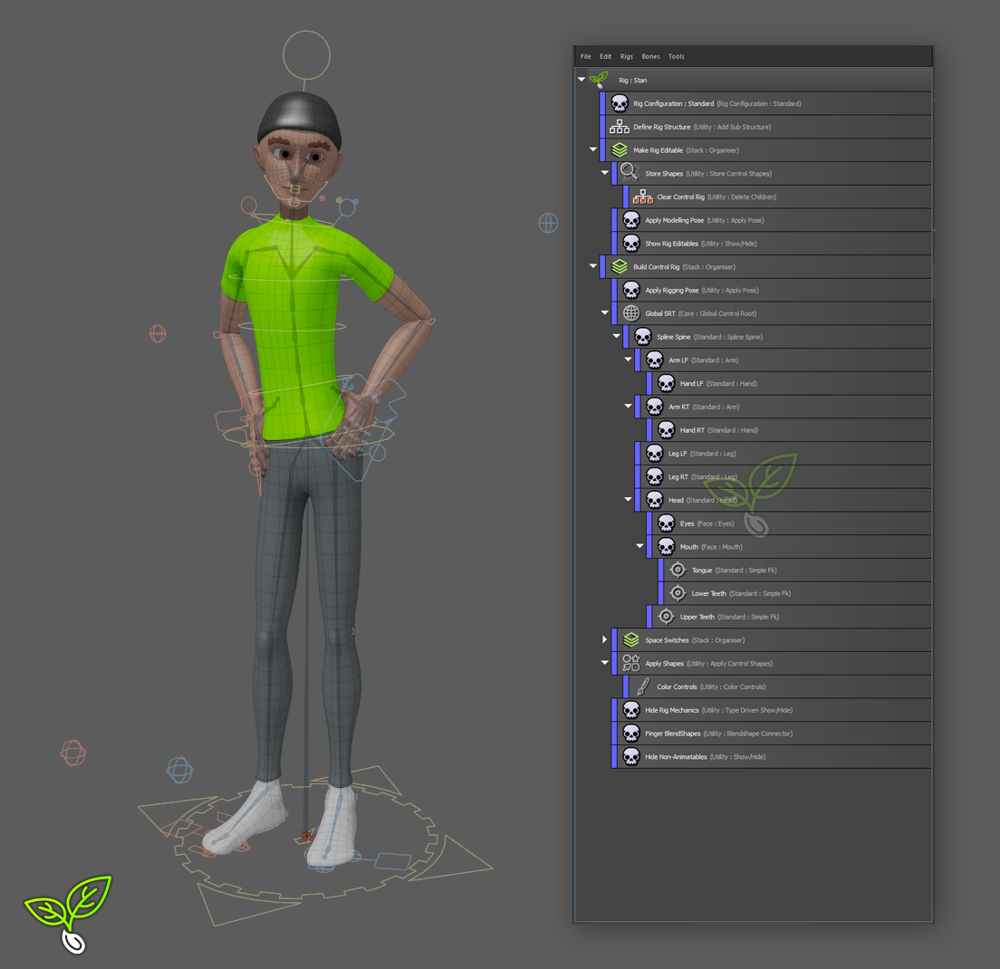

# Aniseed
Aniseed is an application embedded (Maya) rigging tool. 



It takes a Joint-First approach whereby the user is expected to provide/draw the 
joint hierarchy (though some components expose functionality to do this for you!), and
you can then point the rig components to the joints you want that component to drive. 

Some components also expose functionality to generate manipulation guides to help 
manipulate joints in a more contextually relevant way (for example the spline spine), 
but it is an important and fundamental aspect of Aniseed that the skeleton is the 
authority. This is a purposeful choice, particularly as game engines require a rigger
to be very concious of the joint transforms and maintaining those transforms whilst
editing and extending rigs. 

Aniseed itself can be thought of as an execution stack, where the rigger can select
any components (or the rig as a whole) and choose to build that stack. Aniseed will then
proceed to execute each component in the order it is presented within the stack.

This approach makes aniseed incredibly flexible, as a component does not have to 
specifically drive joints, or could simply modify what has been been before it (a great
example of this is the space switching mechanism).

<span style="color:orangered">
IMPORTANTE NOTE: Aniseed is currently in OPEN BETA. It is not yet ready for use in a 
production environment. It is expected to reach Open Release late december 2024.
</span>


# Installing

### Using the Drag & Drop Installer
To install aniseed within Maya download the release and unzip it into your downloads folder. 

Navigate into the unzipped folder and you will see a drag_drop_install.py file. Simply drag 
and drop that into the Maya viewport. This will start the installation process.

By default, the aniseed module will be installed in your maya's user location within the
module's folder. 

A video walkthrough of installing Aniseed can be found here:

https://youtu.be/hMnltJR2OWE


### Manually Installing
Aniseed is packaged as a *Maya Module*, therefore to manually install it you should
upzip the release, then place the .mod and the aniseed_maya folder within one of the 
MAYA_MODULE_PATH locations. 

# Launching

Aniseed will show in the main menu when you switch to the rigging workspace. To launch
the main tool, choose "Anseed Builder".


All of aniseed is also fully exposed through Python. You can launch the Aniseed Builder
using the following python code

```python
import aniseed
aniseed.app.launch()
```

Note: All functionality available through the UI is also available in a headless/code-only
form as well.

# Getting Started with Aniseed

When you first launch Aniseed, it will look like the image shown below. This is what
you will see when there is no rig present within the scene. 


The menu at the top allows you to create new rigs, switch between rigs in the scene
as well as exposing various bone mand shape manipulation tools. 

## Creating a new Rig

Click File/New Rig


This will ask you  for a name for your rig. This is simply the name it will assign to
the rig node adn you can change this at any time. 

Your tool should now appear like this:


"Rig : MyExampleRig" is our actual rig. All components we create will be a child of 
this in some form. The "Rig Configuration" is a special component - all rigs MUST have
a "Rig Configuration" component. By default Aniseed will create this for  you, however
if you're working in a studio pipeline where you dont want a rig configuration or you 
want to specify your own to be created automatically you can do this through the 
preferences (Edit/Preferences).

If you select the "Rig Configuration" component you will see that you are presented
with all its options. This allows you to tailor the conventions the tool will use when
building the rig. 

Components may expose any (or all) of the following:

### Requirements
These are fields that you are expected to fill in. They are typically mandatory for the
component to build and usually represent objects which that component needs.

### Options
These are fields that allow you to tailor the result of the component. This may allow 
you to change the behaviour of the component or the naming of the component etc. These
are usually predefined with default values.

### Outputs
These are fields which the selected component promises to populate as part of its 
execution. Typically with requirements (or any field that expects an object), you can 
chooes to either enter the objects name, or you can provide an "address" to an output
field. By using the address you're not hard coding the naming convention into your
setup. This is covered in more detail below.

## Adding Components & Building
This is the absolute minimum for a rig - if you right click the "Rig : MyExampleRig"
you will be presented with a context menu. From this menu you can select "Build", and 
that will execute (build) all the components declared in the rig. In this case, nothing 
will change in the scene, as the only component (the configuration component) does not 
actually do anything in of itself. However, you should see it go green to say that it 
was successfully executed.

Right click the Rig node again, and this time choose "Add Component". This will present
you with a dialog showing all the available components. 


As well as showing you all the available components, you can click a component and 
see any help text that component offers. Some components will also expose some of their
options to you through this dialog as well. Its worth noting that any options you set
in this dialog can be changed later too.

## Example Workflow

To demonstrate this, select the "Mechanics : Two Bone IK" component and set the location
option to "md", then click "Add". This will add that component to the aniseed stack. Now
you can click that component and see that it requires a Parent as well as a Root joint
and a Tip joint (as shown below).


All three of the requirements for this component require "objects" (i.e, nodes in the 
scene). This field has two buttons next to it, the button highlighted in orange will 
fill the field with the selected object whilst the butten highlighted in yellow will 
select the object in the scene. Start by selecting the rig node in the outliner and then
clicking the "Set From Scene" button. This will place the nodes name into that field. 

Now draw three joints in a hierarchy within your scene. Select the first joint and fill
in the "Root Joint" field, then select the last joint and fill in the "Tip Joint" field.

Lets go ahead a test our rig - right click the "Rig : MyExample" section at the top of
the Aniseed tool and choose "Build/Build Rig". You should see the components go green 
and a set of IK controls built around your skeleton. 

This is the most simplistic way of using Aniseed, where you're working with the stack 
as a Linear Execution Stack (i.e, building all components from top to bottom).

## Iterative Building Workflow

In reality, when we build rigs we rarely get things exactly as we want them first time. 
Quite often we will want to rebuild our rig, then change some settings or extend it 
further and rebuild it again. This process is usually repeated a lot during the lifespan
of a rig in production - and it is why dedicated rigging tools such as Aniseed exist. 

Therefore, simply executing all components from top to bottom is not incredibly 
efficient. If we take the example above, if we hit build again, we would end up with 
another set of IK controls for each time we built our rig. Therefore it would require 
the rigger to clean the scene up each time. 

This is why Aniseed allows you to execute "sub sections" of a stack rather than the 
whole stack. This way you can group your stack its different sets of functionality
which can be invoked for different purposes. 

You can see this in practice if you right click the "Rig Configuration" item and choose
"Create Initial Component Structure". This initial rig structure is intended as a 
"good practice starting point". As you can see in the image below, it defines an inital 
rig structure - this just creates a series of group nodes to help keep our skeleton, 
geometry and controls seperate from one another. 

We then have a "Make Rig Editable" section. This has nodes which specifically look over
the control rig, store shape information and then delete the control rig. 

The "Build Control Rig" does what it says on the tin. This section creates a global 
control root, re-applies control shapes and applies control colours. 


# Using Aniseed 

This area of the documentation is still to be completed. But there are some video walkthrough guides:

Part00 Installing Aniseed :
https://youtu.be/hMnltJR2OWE

Part01 The Principals Of Aniseed :
https://youtu.be/krWXOA1ZJwA

Part02 Creating An Iterative Execution Stack :
https://youtu.be/xXWkc2qq0YU

Part03 Working With Joints PartA :
https://youtu.be/tdYFYp4Ynvo

Part03 Working With Joints PartB :
https://youtu.be/7ZX-4sF7-wk

Part04 Creating A Biped :
https://youtu.be/Id81lMvX_RI

Part05 Modelling And Rigging Poses :
https://youtu.be/lawT3pwYmHs

Part06 Space Switches :
https://youtu.be/Ms6fq9Sw11I

Part07 Saving And Loading Rigs :
https://youtu.be/hnETOU7BY9g

Part08 Writing Your Own Components :
https://youtu.be/QdxxNme4GhQ

Other Videos:

Using Attribute Linking : https://www.youtube.com/watch?v=Dq4BQHALcEk&feature=youtu.be


# Coding With Aniseed

If you want to add your own rigging components you can either:

* Place your components within the aniseed/components folder (or subfolder). This
is useful for small development studios or individuals.


* Place your components in a folder and declare that folder path in an environment
variable called ANISEED_RIG_COMPONENT_PATHS. This option is particularly useful
for larger development studio's whom have a requirement to keep open source code
seperate from their internally developed code.

## Aniseed Classes

The Rig class is the one you will typically use as the entrypoint to working with Aniseed
at a code level. The rig class gives a pointer to the node representing the rig as well as 
containing all the information about the components that form to make up the rigs execution. 

Crucially it also gives access to the rigs configuration - which is covered below.

You can create a new rig using the following code. This will create a rig called MyNewRig
in the scene. It will expose all the components that are available to aniseed out the box.

```python
import aniseed

new_rig = aniseed.MayaRig(label="MyNewRig")
```

Alternatively, if there is already a rig in the scene, assuming the rig transform is called
MyNewRig, you can do...

```python
import aniseed

new_rig = aniseed.MayaRig(host="MyNewRig")
```

Now that you have a rig class instanced, you can start adding components to your rig. In this
example we add some basic components to demonstrate. 

```python
new_component = new_rig.add_component(
    component_type="simple_fk",
)
```


As well as just adding the component, we can define options and requirement values at the same
time as adding the component, like so:

```python
new_component = new_rig.add_component(
    component_type="simple_fk",
    requirements={
        "Parent": "Foobar",
        "Joints To Drive": ["A", "B", "C"],
    },
    options={
        "Label": "Head",
    }
)
```

The approach above allows you to specify values at the time of the components creation. However, 
you can also set these values directly on the component after creation too. This is done like this:

```python
new_component = new_rig.add_component(
    component_type="simple_fk",
)
new_component.requirement("Parent").set("Foobar")
new_component.requirement("Joints To Drive").set(["A", "B", "C"])
new_component.option("Label").set("Head")
```

The result between these two examples is exactly the same.

Now that we have components in our rig, we can build it. To do this is simply:

```python
new_rig.build()
```

That will run through all the components in the rig and execute them.

Note that a rig must **ALWAYS** have a Rig Configuration component added to it in 
order to build. A RigConfiguration is nothing more than a component that exposes a
specific set of parameters and functions that allow a user to tailor how a rig is
built. 

Aniseed comes packaged with a rig configuration which is designed to be flexible, 
however if you find that you need something more, you can always subclass the RigConfiguration
component and implement your own. This is explained below.


## Adding Components

Components are where most of the code exists within any Aniseed deployment. It is 
utlimately where all your rig building code resides. Out the box aniseed comes with 
a library of components that will hopefully allow you to create a variety of rigs
but you can also extend it with your own additional components as well.

To do this, you will need to subclass the aniseed.RigComponent class. Here is a 
documented example:

```python

import aniseed
import maya.cmds as mc


# -- The name of the class is not important but it must inherit
# -- from the RigComponent class
class MyCustomComponent(aniseed.RigComponent):
    
    # -- All components require a unique identifier string
    # -- to allow it to be dinstinguishable from other 
    # -- components
    identifier = "my_custom_component_example"
    
    # -- We need to re-implement the __init__. This is where we declare
    # -- any options and requirements the component should have
    def __init__(self, *args, **kwargs):
        super(MyCustomComponent, self).__init__(*args, **kwargs)

        # -- Here we are defining a requirement. A requirement is considered
        # -- to be an input that this component needs fullfilling by the user
        # -- in order to execute.
        # -- Note that we can set validate to either true or false. If it is
        # -- true then the requirement will be tested before execution to ensure
        # -- that the user has a set a value. 
        self.declare_requirement(
            name="Parent Node",
            value=None,
            validate=True,
        )

        # -- Now we will declare an option. Options are much like requirements
        # -- except they are not typically mandatory and serve more to allow a
        # -- user to tailor the execution of the component
        self.declare_option(
            name="Name Prefix",
            value=""
        )
    
    # -- The run function is what is executed when a rig is built
    def run(self):
        
        # -- In our example we are just going to create a transform 
        # -- node and name and parent it to demonstrate how we access
        # -- the properties we have declared
        
        # -- Notice that when we access the requirement, we use .get()
        # -- in order to get the actual value from the property
        parent = self.requirement("Parent Node").get()
        
        # -- We now do the same for the options
        prefix = self.option("Name Prefix").get()
        
        # -- At this point we're now just running vanilla maya code. 
        node = mc.createNode("transform")
        
        mc.parent(
            node,
            parent,
        )

        mc.rename(
            node,
            prefix + "MyNode",
        )
```

By default, the aniseed application will attempt to display requirements and options
in the UI based on the variable type that they are set to. For instance, if you set 
a requirement as a string it will show it as a text field in the ui.

However, quite often we want to display our options in richer ways. For instance, whilst
an object might be a string, it is useful to have a mechanism to allow the user to set it
from the current selection, or to select the object.

This is done through the `option_widget` and `requirement_widget` functions which can
be re-implemented. Here is an example:

```python

import aniseed
import PySide6


# -- The name of the class is not important but it must inherit
# -- from the RigComponent class
class MyCustomComponent(aniseed.RigComponent):

class MyCustomWidget()
```

That is a simple example of implementing a custom component in aniseed. In order to 
utilise your component it will need to be placed in a location where aniseed is set
to search. 

If you store your components outside of the aniseed base location (which is recommended)
then you will need to pass your component folder to the rig at time of instancing using

```python
import aniseed

rig = aniseed.MayaRig(
    label="foo",
    component_paths=["my/path/to/my/components"]
)
```

Alternatively you can add your component path to the following environment variable:
`ANISEED_RIG_COMPONENT_PATHS`

For studio deployments it is strongly recommended to use the environment variable approach 
and to keep your custom components seperate from the aniseed deployment.

## Utils 

Rigging code is typically filled with repetative tasks. Aniseed comes with some utility
functionality you may find useful. However, its worth noting that there is no requirement
to use any of the utility functionality

# Extending aniseed_dev_alpha

pass

# Alpha Tracking List

### Road To Release
These items are considered "critical to do before general release"

* Documentation for each component
* Updated video guides
* Rig Example Characters
* Code clean

### Medium Priority
* On component not recognised, add in a stand in
* Add aim tool
* Make each bony tool a maya command
* Expose Aniseed functionality to maya commands
* Discuss the vendor/scripts location - does it make sense?
* Clean up tree.py, particularly around the menu generation
* Show Help/Description of options/requirements in ui
* Comment Bony
* Comment Crosswalk
* Comment Shapeshift


### DONE LIST:
* Done : Manipulation Guide for Tri Leg
* Done : Manipulation Guide for Leg
* Done : Manipulation Guide for Arm
* Done : Bony writer to orient in worldspace
* Done : Simple Ik Component
* Done : Allow for components to be locked/clamped at specific versions
* Done : Expose version info to the ui
* Done : Eye Component
* Done : Add mirror shapes to shapeshift
* Done : Add shapeshift save/load to aniseed
* Done : Insert Control Component (an FK control which does not require a joint)
* Done : On creation of a rig component instead of relying on the user to add left / right into the name and then setting the left / right attr in the component could you have that option in the creation dialogue so it would ask for the component name and have a dropdown for center / left / right?
* Done : Spline Spine
* Done : Tri Leg
* Done : Hide tech joints and nodes in manipulation guide for spline spine
* Done : Adding copy skin to unskinned mesh tool
* Done : Add Skin Disconnect/Reconnect tool
* Done : ability to reference outputs of a component from another component
* Done : Ability to "copy" an unbuilt node name from a node to be able to paste into a child (done through attribute addresses)
* Done : Possible to infer some attributes from parent (side when building a hand to an arm for example). (LD)
* Done : Possible to disable/enable (checkboxes etc) on components in the Ui to skip on validation and build?
* Done : Possible to Duplicate a component through the Ui?
* Done : That dropdown to spawn components is going to become huge very quickly.  I would consider categorizing them and put those categories as options into the right click menu.  Categories like rig part / connection / process / whatever / whatever
* Done : Add dedicated window to display components which has a filtering option
* Done : Categorise component identifiers (This will be a breaking change) 
* Done : Default Configuration is added when creating a new rig (user can enable/disable this)(user can specify the config)(configs can still be removed and added)
* Done : Auto adjustment of layout based on aspect ratio is now off by default, and can be manually enabled
* Done : Aniseed preferences are now implemeneted and exposed through the ui (first pass ui)
* Done : Auto mirror the joints based on left/right location (HS)
* Done : Fix for component data saving/loading
* Done : If the ui is not visible when a new scene is made, it will not re-populate automatically
* Done : Fix for crash on showing ui between sessions
* Done : Store constraints in rig export (this will be a breaking change for existing json files)
* Done : Import & Export functionality is currently part of the app, not the rig
* Done : Show/hide component
* Done : Hide non-control elements**
* Done : Align output text on execution
* Done: rename component
* Done : Create joints for leg
* Done : Create joints for head
* Done : grouping for all components
* Done : config ui
* Done : Switch bony menu to be data based
* Done : put the bone stuff in a bone tools module
* Done : icons for bones menu
* Done : icons on ui helper widgets
* Done : Expose Joint Orient Tools
* Done : expose shape save/load
* Done : bone tool: pin
* Done : bone tool: unpin
* Done : pin with aim alignment
* Done : bone tool: align ik
* Done : drawing of line when dragging items
* Done : scroll area for options and requirements
* Done : save rig elements on file save
* Done : mirror across
* Done : custom ui on mirror across?
* Done : Apply/Store A/T Pose should be stored in the option data, not the bone
* Done : Align IK with option to retain child ws transforms
 
### Feedback to be discussed and tasked
* Option to read "Apply Pose" data from bones first, and component second to allow a Richard Lico workflow (i.e, building rigs on the fly) (HS)
* Components to store/apply animation data to support a Richard Lico approach (HS)
* Option to lock skeleton from accidental edits (HS)

* Could there be the desire to specify the mirror behavour mode? : Left/Right = axis-down/axis-up (ala Unreal mannequin / mGear) ; Left/Right = axis-down/axis-down +180 (ala traditional)
